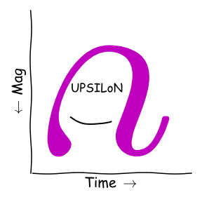
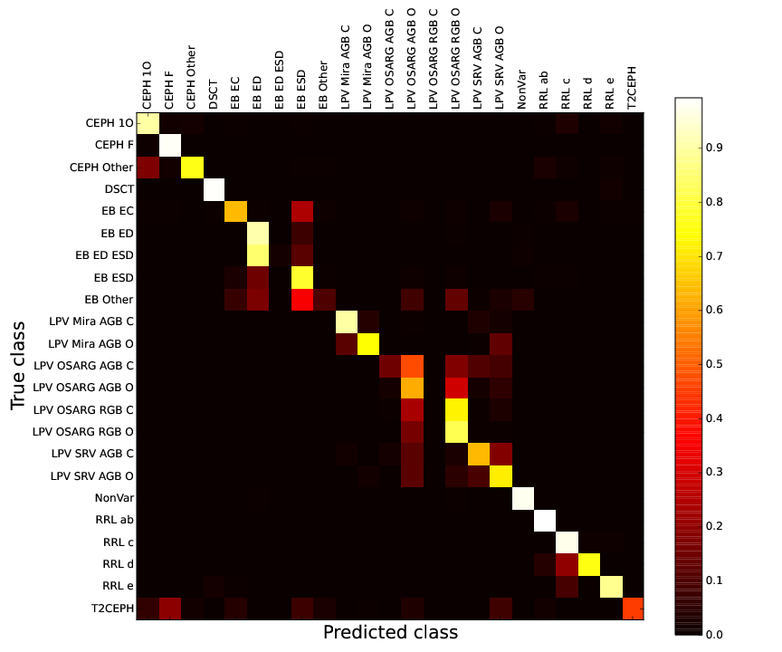

# UPSILoN
<div align="center">
<br/>
[ UPSILoN - <font size="4">&#120650;</font> ]
</div><br>


<b>Important Note</b>: If you upgrade to the version >= 1.2.0 from the previous version (i.e. <= 1.1.5), please read [Detailed Usage](#5-details-about-upsilon-usage). There are some changes in the outputs of the predict functions. See [ChangeLog](#changelog) for the summary.


UPSILoN (A<b>U</b>tomated Classification of <b>P</b>eriodic Variable <b>S</b>tars 
using Mach<b>I</b>ne <b>L</b>ear<b>N</b>ing) aims to classify periodic variable stars such as [Delta Scuti stars](http://en.wikipedia.org/wiki/Delta_Scuti_variable), [RR Lyraes](http://en.wikipedia.org/wiki/RR_Lyrae_variable), [Cepheids](http://en.wikipedia.org/wiki/Cepheid_variable), [Type II Cepheids] (http://en.wikipedia.org/wiki/Type_II_Cepheid), [eclipsing binaries](http://en.wikipedia.org/wiki/Binary_star#Eclipsing_binaries), and [long-period variables](http://en.wikipedia.org/wiki/Long-period_variable_star) (i.e. superclasses), and their subclasses (e.g. RR Lyrae ab, c, d, and e types) using well-sampled light curves from any astronomical time-series surveys in optical bands **regardless of** their survey-specific characteristics such as color, magnitude, sampling rate, etc (<a href="http://arxiv.org/abs/1512.01611">Kim & Bailer-Jones 2015</a>).


UPSILoN mainly consists of two parts, one is extracting variability features from a light curve, and  another is classifying a light curve. UPSILoN, thus, returns extracted features, a predicted class, and a class probability.


In principle, UPSILoN can classify any light curves having arbitrary number of data points. However, for the best classification quality, we recommend to use light curves with more than ~80 data points.
 

## Index
1. [Dependency](#1-dependency)
2. [Installation](#2-installation)
3. [Test the Installation](#3-test)
4. [How to Use UPSILoN](#4-pseudo-code-how-to-use-upsilon)
5. [Detailed Usage](#5-details-about-upsilon-usage)
6. [UPSILoN Classification Quality](#6-upsilon-classification-quality)

- [Minimum Requirements](#minimum-requirements) 
- [ChangeLog](#changelog)
- [Citation](#citation)


## 1. Dependency
[Python 2.7+ or 3.5+](https://www.python.org/)

[Numpy 1.11.2+](http://www.numpy.org/)

[Scipy 0.18.1+](http://scipy.org/)

[scikit-learn 0.18.1+](http://scikit-learn.org/stable/)

[pyFFTW 0.10.4+] (http://hgomersall.github.io/pyFFTW/)

 * pyFFTW is optional but <b>highly recommended</b> for multi-threads usage for FFT. You will need to install [FFTW] (http://www.fftw.org/) as well prior to installation of pyFFTW.

These libraries (except pyFFTW) will be automatically installed if your machines do not have them yet. In the case you encounter errors during the installation of the dependencies, try to install them individually. Your machine may not have other necessary libraries that are required by the dependencies.


## 2. Installation

The easiest way to install the UPSILoN package is:

```python
pip install upsilon
```

Or,

```python
pip install git+https://github.com/dwkim78/upsilon
```

Since the UPSILoN package contains a Random Forest classifier (~50 MB), downloading the package might take some time.

If you do not want to install/upgrade the dependencies, execute the above commend with the ```--no-deps``` option. UPSILoN possibly works with older version of Python, Numpy, and Scipy, but you must have the latest version of scikit-learn (i.e. 0.18.1+).


Alternatively, you can download the UPSILoN package from the Git repository as:

```python
git clone https://github.com/dwkim78/upsilon

cd upsilon
python setup.py install
```

You can edit ```setup.py```, if you do not want to update Python, Numpy and Scipy (i.e. edit the ```install_requires``` variable). Note that downloading the Git repository will take longer since it downloads the entire git history including the ".git" folder.

## 3. Test

To check if the UPSILoN library is successfully installed, type the following code:

```python
import upsilon
upsilon.test_predict()
```

This code reads a sample light curve of a Cepheid variable, extracts features, and classify it. At the end of log messages, you must see the line something like:

```
yyyy-mm-dd hh:mm:ss,mmm INFO - Classified as CEPH_1O with the class probability 0.91
```

If the light curve is not classified as a Cepheid variable, or if the class probability is not 0.91, something might be wrong. In that case, please contact me.

## 4. Pseudo Code: How to Use UPSILoN? 

The following pseudo code shows the entire processes of how to use UPSILoN.

```python
import upsilon

# Load a classification model.
rf_model = upsilon.load_rf_model()

# Extract features from each light curve and predict its class. 
for light_curve in set_of_light_curves:
    # Read the light curve's date (in days), magnitude, and magnitude errors.
    ...
    date = np.array([...])
    mag = np.array([...])
    err = np.array([...])
        
    # Extract features
    e_features = upsilon.ExtractFeatures(date, mag, err)
    e_features.run()
    features = e_features.get_features()
    
    # Classify the light curve
    label, probability, flag = upsilon.predict(rf_model, features)
    print label, probability, flag
```


## 5. Details about UPSILoN Usage

### Preparation

In order to extract features from a light curve, one needs to prepare three variables, each of which is a numpy array of dates in days, magnitudes, and magnitude errors. For example, see the following pseudo code.

```python
date = np.array([...])
mag = np.array([...])
err = np.array([...])
```

If necessary, these three variables have to be refined prior to being ingested to UPSILoN. For instance, invalid values (e.g. nan, inf, etc.) among these variables must be removed. For refining light curves, UPSILoN only provides a sigma-clipping routine. You can use it as:

```python
date, mag, err = upsilon.utils.sigma_clipping(date, mag, err, 
    threshold=3, iteration=1)
```

This removes fluctuated data points in magnitudes. By default, the module removes fluctuated data points with 3 sigma-threshold with one iteration.


### Extracting Features

Once you have these three variables, you can extract features as:

```python
e_features = upsilon.ExtractFeatures(date, mag, err)
e_features.run()
features = e_features.get_features()
```

If there are no magnitude errors, you can do as follows:
```python
e_features = upsilon.ExtractFeatures(date, mag)
``` 
In this case, UPSILoN will use a standard deviation of magnitudes as errors.

The returned ```features``` is an OrderedDict variable containing the names of features (i.e. key) and values of the features (i.e. value), sorted by the names. The following table shows a list of the keys. For details about these features, see <a href="http://arxiv.org/abs/1512.01611">Kim & Bailer-Jones 2015</a>. Among these features, only 16 marked with (+) are used to predict a class. Other features marked with (-) are additional features.

| Key | Description |
|----:|:------------|
| amplitude (+) |  Amplitude from the Fourier decomposition  |
| hl_amp_ratio (+) |  Ratio of higher and lower magnitudes than the average | 
| kurtosis (+) |  Kurtosis   |
| period (+) |  Period   |
| phase_cusum (+) |  Cumulative sum index over a phase-foled ligit curve  |
| phase_eta (+) |  Eta over a phase-foled ligit curve   |
| phi21 (+) |  2nd and 1st phase difference from the Fourier decomposition   |
| phi31 (+) |  3rd and 1st phase difference from the Fourier decomposition    |
| quartile31 (+) |  3rd quartile - 1st quartile   |
| r21 (+) |  2nd and 1st amplitude difference from the Fourier decomposition   |
| r31 (+) |  3nd and 1st amplitude difference from the Fourier decomposition   |
| shapiro_w (+) |  Shapiro-Wilk test statistics  |
| skewness (+) |  Skewness   |
| slope_per10 (+) |  10% percentile of slopes of a phase-folded light curve   |
| slope_per90 (+) |  90% percentile of slopes of a phase-folded light curve   |
| stetson_k (+) |  Stetson K  |
| cusum (-) |  Cumulative sum index  |
| eta (-) |  Eta index   |
| n_points (-) | The number of data points in a light curve |
| period_SNR (-) | SNR of period derived using a periodogram |
| period_log10FAP (-) | False alarm probability of period |
| period_uncertainty (-) | Period uncertainty based on a periodogram |
| weighted_mean (-) | Weighted mean magnitude |
| weighted_std (-) | Weighted standard deviation of magnitudes |

If pyFFTW is installed, UPSILoN utilizes multiple cores to derive a period because the period estimation takes a lot longer than calculating all other features. By default, UPSILoN uses 4 cores. If you want to use more, do as follows:

```python
e_features = upsilon.ExtractFeatures(date, mag, err, n_threads=8)
```

Using Macbook Air 2012 equipped with Intel Core i5 1.8 GHz (2 cores and total 4 threads) and 8 GB memory, extracting a period takes 1-2 seconds per light curve containing several hundreds of data points.

After extracting features, you may want to check if the derived period is in a range of period alias (e.g. one day, sidereal day, one month, etc). UPSILoN provides a simple module to check it as:

```python
is_alias = upsilon.IsPeriodAlias(features['period'])
```

If ```is_alias``` is ```True```, then the period is possibly an alias. In such case, one must be careful to classify the light curve, since classification could be wrong. Note that we also included additional aliases empirically determined based on the 
[OGLE] (http://ogle.astrouw.edu.pl/) 
and 
[EROS-2] (http://eros.in2p3.fr/) 
dataset 
([Kim et al. 2014] (http://adsabs.harvard.edu/abs/2014A%26A...566A..43K)).
 

<b>Note</b>: You are welcome to suggest new additional features if it is not computationally time-consuming. The list of additional features will be updated accordingly.


### Classification

Before predicting a class, one must read a Random Forest classification model as

```python
rf_model = upsilon.load_rf_model()
```

NOTE: Loading the model takes 5-20 seconds depending on machines. Thus, be careful not to load it multiple times.

You are now ready to classify the light curve.

```python
label, probability, flag = upsilon.predict(rf_model, features)
```

That's all! Now you know the class of your light curve, ```label```, and its class probability, ```probability```, as well. ```flag``` is defined as follows:

| Key | Description |
|----:|:------------|
| 0 | Successful classification |
| 1 | Suspicious classification because 1) period is in period alias, or 2) period SNR is lower than 20 |


### Tip


By the nature of UPSILoN, it can distinguish periodic variable light curves from non-variables. Nevertheless, since feature extraction takes lots of time, removal of non-variable light curves before running UPSILoN would significantly reduces the total processing time.


In addition, note that it remains fundamentally difficult to find an universal and consistent way of removing such non-variable light curves from individual time-series surveys on account of the diverse survey characteristics (e.g. systematic trends, variable noise levels, etc). Thus we do not guarantee that UPSILoN will efficiently exclude non-variables during the classification of light curves from other surveys.


Nonetheless, even though UPSILoN does not use a period SNR for classification because it is somewhat correlated with the number of data points in light curves, a period SNR could be a powerful feature to discriminate non-variable sources from others if one uses it carefully. From our previous work ([Kim et al. 2014] (http://adsabs.harvard.edu/abs/2014A%26A...566A..43K)), we empirically found that  almost all of the non-variables have period SNRs lower than 20 regardless of the number of data points, whereas variables except DSCT have period SNRs generally higher than 20. Thus if 1) UPSILoN is applied to well-sampled light curves consisting of more than a few hundreds of data points, and 2) DSCT classification is not important, then the variable candidates with period SNR lower than 20 can be discarded (i.e. the value of ```flag``` is 1).


### Logger

If you want to write log messages either to console or to disk, you can use the UPSILoN Logger class as:

```python
logger = upsilon.Logger().getLogger()

logger.debug('debug message')
logger.info('info message')
logger.warn('warn message')
logger.error('error message')
logger.critical('critical message')
```

Keep in mind that you need to generate only one logger instance through the whole processes, but not many. If you want to save log messages to a file,  generate a logger instance as follows:
 
 ```python
 logger = upsilon.Logger('/PATH/TO/FILE.log').getLogger()
 ```

This will send log messages to both console and a log file. Note that the path must be the absolute path.


## 6. UPSILoN Classification Quality

The UPSILoN classifier was trained on the [OGLE] (http://ogle.astrouw.edu.pl/) 
([Udalski et al. 1997] (http://adsabs.harvard.edu/abs/1997AcA....47..319U)) and 
[EROS-2] (http://eros.in2p3.fr/) periodic variables ([Kim et al. 2014] (http://adsabs.harvard.edu/abs/2014A%26A...566A..43K)). The hyper parameters of the classifier were tuned using grid-search and 10-fold cross-validation.

The classifier trained using only superclasses shows 98% recall and precision whereas the classifier trained on subclasses shows 81% recall and precision. The confusion in the subclass classifier was mainly caused by misclassification within superclasses. The following figures show classification quality of the subclass classifier. Each cell shows the fraction of objects of that true class (rows) assigned to the predicted classes (columns) on a gray scale. Thus the values on the leading diagonal are the recall rate. We show the number only if it is larger than or equal to 0.01.

<div align="center">

<br>[ Map of the confusion matrix of the subclass model ]
</div><br>

UPSILoN provides the classifier trained using all the subclasses. For the comprehensive experiments on classification performance using the [MACHO] (http://wwwmacho.anu.edu.au/), [LINEAR] (http://neo.jpl.nasa.gov/programs/linear.html), [ASAS] (http://www.astrouw.edu.pl/asas/), [Hipparcos] (http://www.rssd.esa.int/index.php?project=HIPPARCOS) datasets, see <a href="http://arxiv.org/abs/1512.01611">Kim & Bailer-Jones 2015</a>. In brief, the UPSILoN classifier shows 0.94, 0.92, and 0.85 [F1 score] (http://en.wikipedia.org/wiki/F1_score) for MACHO, LINEAR, and ASAS, respectively. In the case of the Hipparcos dataset, it contains many other types of variable stars that are not in the UPSILoN training set, and thus it is a suitable dataset to see how much those other types could degrade UPSILoN classification performance. In brief, UPSILoN classes such as DSCT, CEPH F, CEPH 1O, and EB ESD can be contaminated by those other variability types.


In <a href="http://arxiv.org/abs/1512.01611">Kim & Bailer-Jones 2015</a>, we also present experiment results using resampled light curves of the MACHO and ASAS dataset for different number of data points from 30 to 300, over different observation duration from 30 days to several years. In brief, UPSILoN successfully classifies the resampled light curves as long as the light curves contain more than or equal to 80 data points.


Note that we provide the random forests model trained with 100 trees and randomly selected 10 features whereas, in <a href="http://arxiv.org/abs/1512.01611">Kim & Bailer-Jones 2015</a>, we used 700 trees with randomly selected 10 features. The [F1 score] (http://en.wikipedia.org/wiki/F1_score) difference between these two models is less than 0.003, which is insignificant given that the classification uncertainty estimated during the cross-validation phase is 0.005. The reason why we provide the 100 trees model is because 1) GitHub does not allow to upload a file larger than 100 MB, and 2) reading a larger file takes longer. The size of the model with 700 trees and 10 features is 360 MB, which is gzipped and written in a binary format. Thus the uncompressed size is much larger (i.e. by a factor of ~10). If you want to use the 360 MB model file for your research, please contact with me.


## Minimum Requirements

Although UPSILoN could be run at any decent machines, we recommend to run it at machines equipped with at least ~2 GB memory because the uncompressed random forests model file could consume a large amount of memory.


## ChangeLog

### v?.?.? (TBC)
- add a complementary classification model of other machine learning algorithm (e.g. Deep Neural Network).
- add additional variability types to the training set, either to classify or exclude them (not determined yet).
- provide web-based classifier for a small set of light curves.
- implementing multilayer classifiers, which might reduce feature extracting time.

### v.1.2.6 (2017/03/14)
- Python 3 compatible. Special thanks to Mike Rosseel ([https://github.com/mrosseel](https://github.com/mrosseel)).

### v.1.2.5 (2016/11/24)
- scikit-learn dependency updated to 0.18.1

### v.1.2.4 (2016/04/15)
- convert docstrings to the Numpy style.

### v.1.2.3 (2016/02/18)
- scikit-learn dependency updated to 0.17.   

### v.1.2.2 (2016/02/17)
- update the predict module according to the scikit-learn update (version 0.17), in order to remove the deprecated warning of "passing 1d arrays".

### v.1.2.1 (2015/10/03)
- the logger class prints milliseconds as well.

### v1.2.0 (2015/08/12)
- changes in the feature returning and class predicting modules.
    - See [Detailed Usage](#5-details-about-upsilon-usage) for details.
    - upsilon.predict(...) now returns an additional value, which is:
        - flag = 0 if classification is successful,
        - flag = 1 if the period_SNR is lower than 20, or if the period is in the range of period alias. Classification result, thus, could be incorrect.

### v.1.1.6
- modify comments/explanation for functions/classes so that is more legible.

### v1.1.5
- bug fixes, code improvements, etc.
- Two additional features added, "cusum" and "eta".

### v1.1.0
- bug fixes, code improvements, etc.
- model improvements for light curves having small number of data points. 


### v1.0 (2015/05/24)
- release of the first version of UPSILoN.
- first upload to [pypi](https://pypi.python.org/pypi/upsilon).

### v0.7
- code improvements, bug fixes, tests, etc.

### v0.6
- add dataset for tests.
- add a module testing the classification model using the dataset.
- add a module for classifying a light curve.

### v0.5
- add a random forests classification model.

### v0.3.1
- add a module to check if a given period is an alias or not.

### v0.3
- structure of features is changed to Python OrderedDict type.
- add a sigma clipping module.
- add a Logger class.
- raise a warning if the number of measurements in a light curve is less than 80.
- other few improvements and bug fixes.

### v.0.2.4
- Bug fixed in the module estimating a period uncertainty. 

### v0.2.3
- add a module calculating a feature based on cumulative sum.

### v0.2.2
- add a module estimating period uncertainty.

### v0.2.1
- add the UPSILoN logo image.

### v0.2
- an improved period extracting module using pyFFTW and multi-threads, which substantially decreases the extracting time.

### v0.1
- add feature extracting modules.


## Citation

If you use UPSILoN in publication, we would appreciate citations to the paper, <a href="http://arxiv.org/abs/1512.01611">Kim & Bailer-Jones 2015</a>, which is based on the UPSILoN version 1.2.1.


## Contact
Dae-Won Kim, email: dwkim78 at gmail.com

Webpage: https://sites.google.com/site/dwkim78/

#### Keywords

astronomy - periodic variables - light curves - variability features - time-series survey - machine learning - classification
